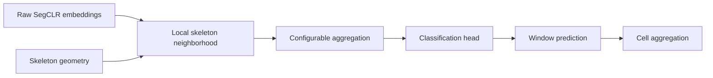

# SegCLR neighborhood classifiers

Cell-type classification from local neighborhoods of raw SegCLR embeddings and neuronal skeletons. The shared pipeline supports mean pooling, per-node transforms, graph message passing, and graph attention. Each neighborhood receives a prediction; window predictions can also be aggregated by cell.



## Explore the project

| Resource | Contents |
|---|---|
| [Model catalog](models/README.md) | Trained runs, recorded configurations, metrics, and checkpoint metadata |
| [Results table](results/summary.csv) | Machine-readable final evaluations, with separate window and cell metrics |
| [Architecture reference](docs/architectures.md) | Supported aggregation methods and classification heads |
| [Analysis notebooks](analysis/README.md) | Notebook index grouped by experiment |
| [Interactive figures](https://jcbliao.github.io/segclr_classifier/) | Existing figure gallery; [source](docs/figures/index.html) and [publishing instructions](docs/interactive_figures.md) |
| [Reproduction guide](docs/reproducibility.md) | Environment, dataset prerequisites, training and verification |
| [Verification record](docs/repository_verification.md) | Notebook execution results and repository checks |

## Train

The project uses Python 3.11 and the environment in `segclr_db/.venv`. Dataset preparation and training require the lab data and paths described in the [reproduction guide](docs/reproducibility.md).

On the lab cluster, submit training through Slurm:

```bash
sbatch scripts/sbatch/train_config.sh configs/baselines/mean.json --results-dir results/reproductions/mean_n20
sbatch scripts/sbatch/train_config.sh configs/graph_transformer/fixed_node.json --results-dir results/reproductions/gt_n20
```

[Configuration recipes](configs/README.md) provide JSON defaults for the existing trainer. Explicit command-line options override those defaults. Existing training launchers continue to work.

## Repository layout

```text
gnn/            Model implementations and metrics
data/           Dataset loaders, preprocessing, and local caches
configs/        Training recipes
models/         Generated model cards and recorded run configurations
results/        Existing experiment outputs and generated summary.csv
analysis/       Experiment notebooks and analysis helpers
docs/           Technical documentation and interactive figures
scripts/        Training, data preparation, inference, and Slurm launchers
archive/        Historical experiment snapshots
```

`20260811/` and `20260812_level4/` remain frozen historical snapshots. The separately managed `segclr_db/` and `segCLR_cell_classification/` dependency clones, local data caches, logs, and checkpoint files are excluded from Git. Model cards record verified publication information separately from experiment results.
